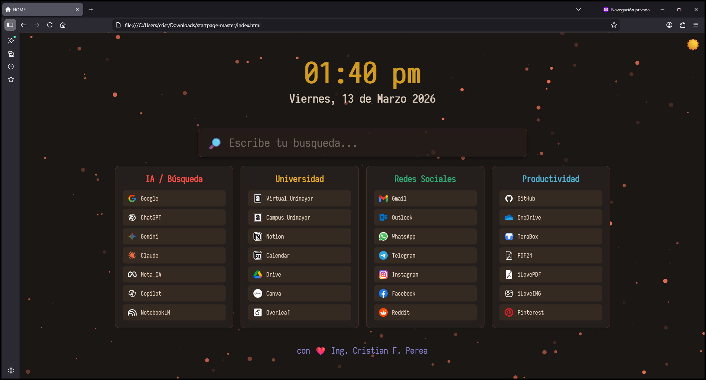

# :sparkles: Página de Inicio (Startpage) :sparkles:

```
/*       _\|/_
         (o o)
 +----oOO-{_}-OOo------------------------------+
 | Página de Inicio para Firefox, Chrome, etc. |
 |    (Startpage for Firefox, Chrome, etc.)    |
 +--------------------------------------------*/
```

## :fleur_de_lis: Sitio Web (Website)

- [HOMEPAGE](https://startpage.github.io)

### :camera_flash: Pantallazo (Screenshot)

 <p align="center">
          
 </p>

---

#### :warning: Importante:

> [!WARNING]
> Los Iconos usados no son de mi propiedad, creditos a sus respectivos autores.

[^1]: [Referencia](https://startpage.github.io)

##### :medal_military: Créditos (Credits)

1. [crisperea88](https://startpage.github.io)

---

###### :fire: Licencia (License)

- [MIT](LICENSE)
